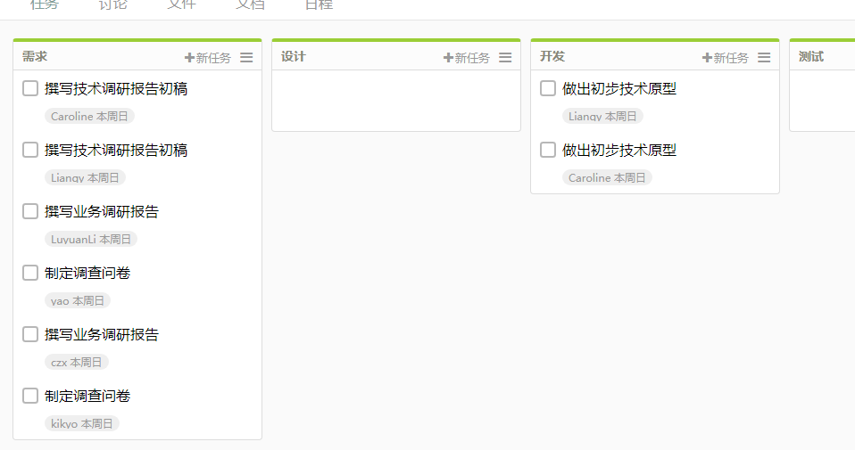

### 系统分析与设计 第二次作业
#### 简答题
##### 1.简述瀑布模型、增量模型、螺旋模型（含原型方法）的优缺点。
**瀑布模型：**  
优点：定义了软件开发基本流程与活动（创意阶段、分析阶段、设计阶段等）
缺点：容易出现项目延期、项目不可控等风险
- 依赖问题：每个活动都依赖于前一步的活动，若前面的需求模糊，则后面的工作难以开展；
- 容错问题：若在后期发现前期的需求问题，则需要投入大量时间进行修改；
- 资源调配问题：每个活动对知识技能的需求不同，对人员数量的要求不同，因此容易出现资源调配不合理的情况问题。

**增量模型：**  
优点：
- 将待开发的软件系统模块化，可以分批次地提交软件产品，使用户可以及时了解软件项目的进展。
- 以组件为单位进行开发降低了软件开发的风险。一个开发周期内的错误不会影响到整个软件系统。
- 开发顺序灵活。开发人员可以对组件的实现顺序进行优先级排序，先完成需求稳定的核心组件。当组件的优先级发生变化时，还能及时地对实现顺序进行调整。

缺点：要求待开发的软件系统可以被模块化。如果待开发的软件系统很难被模块化，那么将会给增量开发带来很多麻烦。

**螺旋模型（含原型方法）：**  
优点：
- 设计上的灵活性,可以在项目的各个阶段进行变更。
- 以小的分段来构建大型系统,使成本计算变得简单容易。
- 客户始终参与每个阶段的开发,保证了项目不偏离正确方向以及项目的可控性。
- 随着项目推进,客户始终掌握项目的最新信息 , 从而他或她能够和管理层有效地交互。
- 客户认可这种公司内部的开发方式带来的良好的沟通和高质量的产品。

缺点：很难让用户确信这种演化方法的结果是可以控制的。建设周期长，而软件技术发展比较快，所以经常出现软件开发完毕后，和当前的技术水平有了较大的差距，无法满足当前用户需求。

##### 2.简述 UP 的三大特点，其中哪些内容体现了用户驱动的开发，哪些内容体现风险驱动的开发？
- Use case driven：开发团队通过代码和测试收集需求，形成用例。（用户驱动的开发）
- Architecture centric：软件架构提供了所有其他发展演变的中心点。（风险驱动的开发）
- Iterative and evolutionary：迭代和进化的方法允许用不完整的，不完善的知识开始开发。（风险驱动的开发）

##### 3.UP 四个阶段的划分准则是什么？关键的里程碑是什么？
- **初始：** 大体上的构想、业务案例、范围和模糊评估。初始阶段结束时是第一个重要的里程碑： **生命周期目标(Lifecycle Objective)里程碑** 。生命周期目标里程碑评价项目基本的生存能力。
- **细化：** 已精化的构想、核心架构的迭代实现、高风险的解决、确定大多数需求和范围以及进行更为实际的评估。细化阶段结束时第二个重要的里程碑： **生命周期结构(Lifecycle Architecture)里程碑** 。生命周期结构里程碑为系统的结构建立了管理基准并使项目小组能够在构建阶段中进行衡量。
- **构造：** 对遗留下来的风险较低和比较简单的元素进行迭代实现、准备部署。构建阶段结束时是第三个重要的里程碑： **初始功能(Initial Operational)里程碑** 。初始功能里程碑决定了产品是否可以在测试环境中进行部署。
- **移交：** 进行beta测试和部署。在交付阶段的终点是第四个里程碑： **产品发布(Product Release)里程碑** 。此时，要确定目标是否实现，是否应该开始另一个开发周期。

##### 4.IT 项目管理中，“工期、质量、范围/内容” 三个元素中，在合同固定条件下，为什么说“范围/内容”是项目团队是易于控制的？
因为范围/内容是项目的核心元素，软件开发最终的目的是生产出范围/内容符合用户需求的产品。在开发过程中，项目的范围/内容可根据用户的需求适当调整，因此相对更易于控制。而工期和质量在合同中已经明确协商好，一旦工期延长或质量下降，就会直接损害用户的利益，因此不能随意更改。

##### 5.为什么说，UP 为企业按固定节奏生产、固定周期发布软件产品提供了依据？
UP采用迭代开发，在这种生命周期方法中，开发被组织成一系列固定的短期小项目，称为迭代。每次迭代都产生经过测试、集成并可执行的局部系统。每次迭代都具有各自的需求分析、设计、实现和测试活动。迭代生命周期基于对经过多次迭代的系统进行持续扩展和精化，并以循环反馈和调整为核心驱动力，使之成为适当的系统。因此UP为企业按固定节奏生产、固定周期发布软件产品提供了依据。

#### 项目管理使用
使用截图工具（png格式输出），展现你团队的任务 Kanban：

