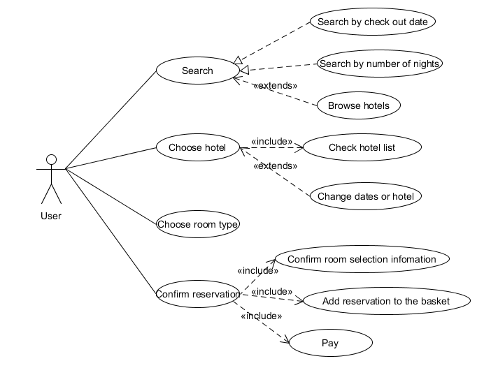
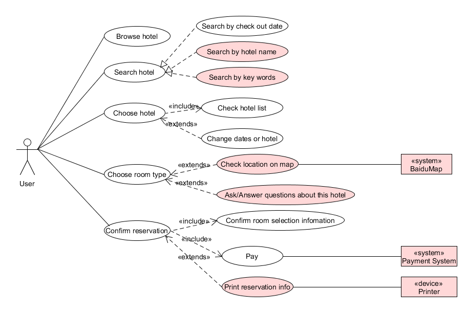

### 系统分析与设计 第3次作业
#### 1、 用例建模
- a. 阅读 Asg_RH 文档，绘制用例图。 按 Task1 要求，请使用工具 UMLet，截图格式务必是 png 并控制尺寸
- b. 选择你熟悉的定旅馆在线服务系统（或移动 APP），如绘制用例图。并满足以下要求：
  - 对比 Asg_RH 用例图，请用色彩标注出创新用例或子用例
  - 尽可能识别外部系统，并用色彩标注新的外部系统和服务
- c. 对比两个时代、不同地区产品的用例图，总结在项目早期，发现创新的思路与方法
- d. 请使用 SCRUM 方法，在（任务b）用例图基础上，编制某定旅馆开发的需求 （backlog）
#### 2、业务建模
- a. 在（任务b）基础上，用活动图建模找酒店用例。简述利用流程图发现子用例的方法。
- b. 选择你身边的银行 ATM，用活动图描绘取款业务流程
- c. 查找淘宝退货业务官方文档，使用多泳道图，表达客户、淘宝网、淘宝商家服务系统、商家等用户和系统协同完成退货业务的过程。分析客户要完成退货业务，在淘宝网上需要实现哪些系统用例
#### 3、用例文本编写
- 在大作业基础上，分析三种用例文本的优点和缺点
  
  
#### 1、用例建模
- a.  

- b.以携程为例  

- c.  
  1、充分进行市场调研，研究调查当地用户的使用习惯，根据用户需求对已有功能进行改进创新，或增加新功能。  .
  2、随着时代的发展，技术的进步，有些新技术可以用于项目之中，增加项目的可用性。因此要关注技术的发展，把项目功能与新技术结合起来，才能做到不断地创新。   
- d. Backlog如下表：

编号 | 名称 | 重要性 | 预计工作量 | 故事描述 | 负责人
--- | --- | --- | --- | --- | ---
0 | 浏览酒店 | 6 | 5 | 用户打开首页，无需手动搜索，即可浏览所在城市的酒店信息 | A
1 | 搜索酒店 | 9 | 10 | 用户输入入住地点、入住日期、退房日期搜索酒店，也可选择性地通过输入酒店名称和周边景点搜索 | B
2 | 选酒店 | 9 | 8 | 用户从酒店列表中选择想预定的酒店，若没有满足条件的酒店，则需要返回更改搜索条件 | C
3 | 选房型 | 8 | 6 | 用户选好酒店后，进入选房型页面，在该页面用户可浏览房型信息、选择房型、通过地图查看该酒店的地点，以及对酒店情况进行提问 | D
4 | 确认预订 | 9 | 8 | 用户选好房型后确认订单，选择支付方式进行支付，支付完成后再次显示订单信息，同时提供打印订单的功能 | E
